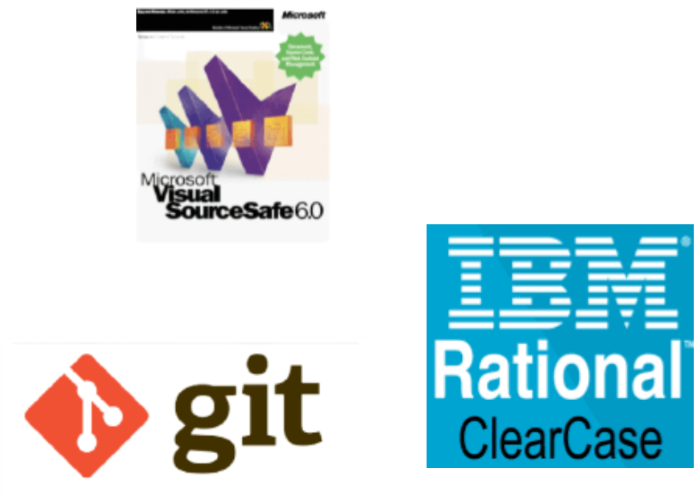
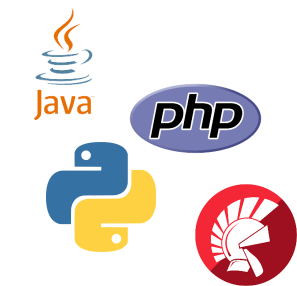
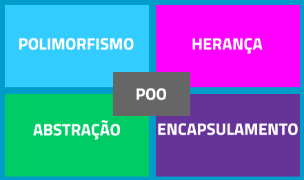

# Desafio1

# 📑 Sistema de Controle de Versão (ou Version Control System) **VCS**

## ✔ Definição de VCS:

É um software que foi criado para gerenciar, controlar e registrar todas as mudanças dos projetos e documentos, é essencial para desenvolvedores de softwares, inclusive se o projeto for de grande escala, com varios desenvolvedores isso possibilitam que eles desenvolvam paralelamente, ele funciona basicamente como um servidor um repositório que guarda todos os dados e arquivos de todas as versões que já foram desenvolvidas. Quando é preciso alterar ou salvar novos arquivos, o usuário entra e faz uma copia da ultima versão e pode continuar o desenvolvendo partindo de onde ele ou alguém da sua equipe parou.

## ✔ 5 vantagens de utilizar um VCS:

- Rastreabilidade
- Histórico do Documento
- Ramificação e fusão
- Redução de duplicação e erros
- Eficiência

## ✔ 3 Exemplos de VCS:

- Git
- Microsoft Visual SourceSafe
- Rational Clear Case

  

  Referências:
  (https://www.devmedia.com.br/sistemas-de-controle-de-versao/24574)
  (http://www.tecnisys.com.br/noticias/2021/quais-sao-os-beneficios-do-controle-de-versao)
  (https://medium.com/@johnsonmauro/sistemas-de-versionamento-de-softwarte-af132dfe7ff9)

# Desafio 2

# 📑 Programação orientada a objetos **POO**

## ✔ Definição de POO:

A programação orientada a objetos surgiu como o novo conceito de enxergar o mundo de outra forma, com mais criatividade sem ser monótono, diversas escolhas, varias formas de resolver o mesmo problema. O criador da primeira linguagem orientada a objetos Alan Kay acreditava que um computador ideal teria que funcionar como um organismo vivo, todos os componentes em plena comunicação, porém funcionando individualmente. Esse nome já é bem explicativo orientação a objetos, tudo é um objeto e ele pode ter suas classes, atributos e métodos com essas características um grande programa pode ser desenvolvido com uma versatilidade extrema. E existem muitas linguagens que é POO como o Java uma das maiores, PHP Delphi, Python e entre outras que estão surgindo, o paradigma de programação orientado a objetos só tende a crescer ainda mais porque é um conceito inovador e revolucionário.

## ✔ Cenário de abstração:

A ideia principal é representar um objeto de forma abstrata, que seja obrigatoriamente herdado por outras classes.
Assim, é possível criar uma classe abstrata com atributos e métodos, mas sua implementação deve ser feita nas classes herdadas. Na programação, é chamada de superclasse, sendo que um objeto não pode ser criado diretamente dela.

## ✔ Cenário de encapsulamento:

O encapsulamento é a capacidade que determinado método ou atributo de um objeto tem de se manter invisível. Ou seja, ele continua funcional, mas sem mostrar como.Isso garante uma camada extra de proteção para a aplicação, pois os detalhes de implementação não são revelados. Se essa é a intenção da pessoa que faz a programação, ela é garantida por meio da declaração de que aquele método é privado e não público.

## ✔ Cenário de herança:

Como o próprio nome diz, trata-se de uma relação de receber algo pré-existente. No caso da POO, a herança é um evento que ocorre entre classes. A doadora é chamada de classe-mãe. Já a classe que herda é chamada de filha. Quando ocorre uma herança, a classe-filha herda as características da classe-mãe. Isso é bastante útil para um reaproveitamento de código, pois não seria necessário refazer algo que já existe.

## ✔ Cenário de polimorfismo:

É uma característica inerente aos métodos dos objetos. Significa dizer que um mesmo método pode ser utilizado em diferentes objetos, de diferentes classes. Podemos imaginar esse tipo de evento ocorrendo num sistema bancário: o extrato (método) mostra a movimentação da conta de clientes de determinada categoria (objeto). No entanto, pode-se usar essa funcionalidade para clientes no geral. Além disso, ele pode ser utilizado no sistema de outros bancos (classes) também!

## 5 vantagens de utilizar um POO:

- Natural
- Reutilizável
- Extensível
- Confiável
- Ajustável

Referências:

- https://blog.betrybe.com/tecnologia/poo-programacao-orientada-a-objetos/
