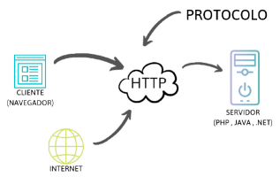

# Desafio 1

# 📑 Sistema de Controle de Versão (ou Version Control System) **VCS**

## ✔ Definição de VCS:

É um software que foi criado para gerenciar, controlar e registrar todas as mudanças dos projetos e documentos, é essencial para desenvolvedores de softwares, inclusive se o projeto for de grande escala, com varios desenvolvedores isso possibilitam que eles desenvolvam paralelamente, ele funciona basicamente como um servidor um repositório que guarda todos os dados e arquivos de todas as versões que já foram desenvolvidas. Quando é preciso alterar ou salvar novos arquivos, o usuário entra e faz uma copia da ultima versão e pode continuar o desenvolvendo partindo de onde ele ou alguém da sua equipe parou.

## ✔ 5 vantagens de utilizar um VCS:

- Rastreabilidade
- Histórico do Documento
- Ramificação e fusão
- Redução de duplicação e erros
- Eficiência

## ✔ 3 Exemplos de VCS:

- Git
- Microsoft Visual SourceSafe
- Rational Clear Case

  

  Referências:
  (https://www.devmedia.com.br/sistemas-de-controle-de-versao/24574)
  (http://www.tecnisys.com.br/noticias/2021/quais-sao-os-beneficios-do-controle-de-versao)
  (https://medium.com/@johnsonmauro/sistemas-de-versionamento-de-softwarte-af132dfe7ff9)

# Desafio 2

# 📑 Programação orientada a objetos **POO**

## ✔ Definição de POO:

A programação orientada a objetos surgiu como o novo conceito de enxergar o mundo de outra forma, com mais criatividade sem ser monótono, diversas escolhas, varias formas de resolver o mesmo problema. O criador da primeira linguagem orientada a objetos Alan Kay acreditava que um computador ideal teria que funcionar como um organismo vivo, todos os componentes em plena comunicação, porém funcionando individualmente. Esse nome já é bem explicativo orientação a objetos, tudo é um objeto e ele pode ter suas classes, atributos e métodos com essas características um grande programa pode ser desenvolvido com uma versatilidade extrema. E existem muitas linguagens que é POO como o Java uma das maiores, PHP Delphi, Python e entre outras que estão surgindo, o paradigma de programação orientado a objetos só tende a crescer ainda mais porque é um conceito inovador e revolucionário.

## ✔ Cenário de abstração:

A ideia principal é representar um objeto de forma abstrata, que seja obrigatoriamente herdado por outras classes.
Assim, é possível criar uma classe abstrata com atributos e métodos, mas sua implementação deve ser feita nas classes herdadas. Na programação, é chamada de superclasse, sendo que um objeto não pode ser criado diretamente dela.

## ✔ Cenário de encapsulamento:

O encapsulamento é a capacidade que determinado método ou atributo de um objeto tem de se manter invisível. Ou seja, ele continua funcional, mas sem mostrar como.Isso garante uma camada extra de proteção para a aplicação, pois os detalhes de implementação não são revelados. Se essa é a intenção da pessoa que faz a programação, ela é garantida por meio da declaração de que aquele método é privado e não público.

## ✔ Cenário de herança:

Como o próprio nome diz, trata-se de uma relação de receber algo pré-existente. No caso da POO, a herança é um evento que ocorre entre classes. A doadora é chamada de classe-mãe. Já a classe que herda é chamada de filha. Quando ocorre uma herança, a classe-filha herda as características da classe-mãe. Isso é bastante útil para um reaproveitamento de código, pois não seria necessário refazer algo que já existe.

## ✔ Cenário de polimorfismo:

É uma característica inerente aos métodos dos objetos. Significa dizer que um mesmo método pode ser utilizado em diferentes objetos, de diferentes classes. Podemos imaginar esse tipo de evento ocorrendo num sistema bancário: o extrato (método) mostra a movimentação da conta de clientes de determinada categoria (objeto). No entanto, pode-se usar essa funcionalidade para clientes no geral. Além disso, ele pode ser utilizado no sistema de outros bancos (classes) também!

## 5 vantagens de utilizar um POO:

- Natural
- Reutilizável
- Extensível
- Confiável
- Ajustável

Referências:

- https://blog.betrybe.com/tecnologia/poo-programacao-orientada-a-objetos/

# Desafio 3 

# 📑 Protocolo de Transferência de Hipertexto (HyperTextTransferProtocol) **HTTP**

## ✔ O que é o protocolo de comunicação HTTP e como ele funciona:

É a base de comunicação de toda Internet, através do HTTP conseguimos de maneira mais fácil encontrar sites e conteúdos que tragam hiperlinks é a troca de dados pela WEB entre o cliente ou servidor. Que funciona Basicamente o cliente usa o navegador e manda uma requisição pelo HTTP uma mensagem, ele transforma esse dado para que o servidor entenda e retorna novamente de forma que o cliente também entenda, ele é o intermediador das partes.

## ✔ O que é REST, e qual é a sua relação com o protocolo HTTP:

REST, em português, significa “Transferência de Estado Representacional” e são varias ações que pode excutar através do Rest, Get, Put, Post, Delete esses são os verbos que transfere a requisição do cliente pelo HTTP e o Rest que promove essa transformação de dados, quando disse acima o HTTP transforma o dado é através do Rest. A ideia geral é a seguinte: seu serviço vai prover uma url base e os verbos pelo HTTP vão indicar qual ação está sendo requisitada pelo consumidor do serviço.

## ✔ O que é Web API, e qual é a sua relação com REST:

As APIs (Application Programming Interfaces) em português Interfaces de programação de aplicativos, ele facilita os desenvolvedores a programar com mais facilidade, disponibilizando interfaces fazendo o que seria mais complexo bem simples. "Às vezes, as APIs são descritas como um contrato entre um provedor e um usuário de informações, estabelecendo o conteúdo exigido pelo consumidor (a chamada) e o conteúdo exigido pelo produtor (a resposta)." artigo Red Hat publicado em 8 de maio de 2020.
API e o REST melhor API REST é uma interface de programação de aplicações (API) que está em conformidade com as restrições do estilo de arquitetura Rest, permitindo a interação com serviços web, é como se a aplicação (API) se comunica com Internet através Rest.

## Liste todos os métodos de solicitações HTTP utilizados pelo padrão REST e suas respectivas finalidades:

- GET: Retorna uma informação
- POST: Criação
- PUT: Salvar
- Delete: Excluir
- TRACE: Retorna a requisição se houve alteração
- PATCH: Atualiza uma parte
- CONNECT: Converte requisição de conexão
- HEAD: Retorna o cabeçalho de uma resposta.

## ✔ O que é Swagger:

É um framework, uma estrutura para as API's, uma maneira de interpretação flexível tanto para os desenvolvedores quanto para a maquina, isso economiza muito mais trabalho e produtividade.

Referências:

- https://www.devmedia.com.br/servicos-restful-verbos-http/37103
- https://developer.mozilla.org/pt-BR/docs/Learn/JavaScript/Client-side_web_APIs/Introduction
- https://www.redhat.com/pt-br/topics/api/what-is-a-rest-api
- https://dev.to/rs_marinheiro/documente-sua-api-springboot-com-swagger-cni

# Desafio 4

# 📑 Repository

## ✔ I. O que é JDBC?

É uma tecnologia usada na implementação do banco de dados.JDBC é uma API de nível de chamada, o que significa que as instruções SQL são transmitidas como sequências para a API, outra vantagem de um programa JDBC é que é bastante móvel e pode ser levado entre diferentes sistemas, com gastos mínimos.

## ✔ II. O que é ORM, cite 3 exemplos?

É tecnica de manipulação e consulta do banco de dados, através da programação orientada a objetos, também é uma biblioteca, uma framework que implementa o caminho do objeto relacional, seu mapeamento. 3 exemplos são Hibernate, NHibernate, Entity.

## ✔ III. O que é JPA e qual é a sua relação com os ORM’s?

O JPA(Java Persistence) é uma framework de espercificação para persistir objetos Java, diferente de ORM(Mapeamento Objeto-Relacional) que apenas é conceito geral. o JPA complementa o ORM, dizendo exatamente de que forma ele pode ser implementado nas aplicações, decidindo qual ferramenta usar.

## ✔ IV. O que é Spring Data?

O spring Data é uma funcionalidade usada para facilitar a vida do programador, deixando a consistente e familiar, ela age de forma ainda mais facilitadora na área de acesso ao banco de dados, serviços de nuvem e entre outros, existem diversos spring data que dar suporte de varias maneiras, é uma framework bastante utilizada.

## ✔ O que caracteriza um projeto “CRUD básico”?

É um projeto que tem as 4 operações básicas em informações amarzenadas em bancos de dados, Create, Read, Update e Delete CRUD, são essas operações básicas que geram quase tudo nas aplicações, por isso muito importantes.

# Desafio 5

# 📑 Service

## ✔ Entity:
No português significa entidades, podemos dizer que ela é início de tudo, a classe principal que tem relacionamento com os outros pacotes, em um artigo de Peter Chen ele definiu uma entidade como “coisas que possuem atributos e relacionamentos”.  História da Entidade é bem antiga na programação, para ser considerada uma entidade é preciso ela ser acessível, ela obtém o objeto principal de quase toda a aplicação, é lá onde os construtores, e os métodos getters e setters acontecem, sem falar que em Java para uma classe se tornar entidade é preciso da anotação @Entity outra anotação importante que consiste em que uma classe se torne uma entity é @Id, que indica que é uma chave primaria e que é a unidade persistente de uma entidade.
 
## ✔ Controller:
Em português o seu nome é controladora, é classe onde acontece muita coisa, basicamente ela controla realmente quase toda aplicação, toda requisição que existe na aplicação passa pela controller, é responsável por mostrar o que está acontecendo dentro da aplicação é mais visível com a controller a entrada da logica do programador com a saída do que está na aplicação está retornando, é por lá que vemos essa conexão entre programa e programador.

## ✔ Repository: 
É responsável pela interface, pela relação entre API e o Banco de Dados, ela gerencia também a pesquisa de objetos de domínio entre a camada de domínio e a camada de mapeamento de dados, se parece com um filtro de informações, em cada camada, ele recebe um objeto com a especificação da pesquisa e retorna uma coleção com os objetos de domínio que satisfazem essa pesquisa. A sua anotação é @Repository. 

## ✔ Service:
É a camada responsável pelas operações de négocio a API, ela pode resgistrar, salvar, verificar, baixar, ela executa várias funções. 

Referências:

- https://www.devmedia.com.br/padrao-mvc-java-magazine/21995

- https://www.devmedia.com.br/definindo-entidades-na-java-persistence-api/28180